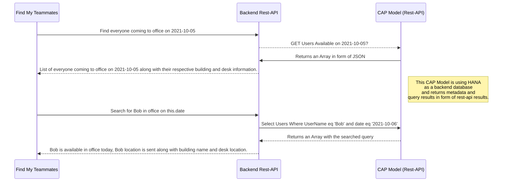

# Find My Teammates

 

Don't get lost searching for that teammate who is a wizard when it comes to solving your problems. Find your teammates easily within office with just one click.

  
# Files and Folder | Purpose

---------|----------
`ODATA API/` | contains the O-Data API created using CAP (SAP Cloud Application Programming Model)

`Appgyver App/` | contains the build version of  Web Version of the Find My Teammates app.

# ODATA CAP Model

***ODATA API FOLDER***

`app/` | content for UI frontends goes here

`db/` | your domain models and data go here

`srv/` | your service models and code go here

`package.json` | project metadata and configuration

  

# Next Steps

  ### Run the ODATA Model Locally

- Open a new terminal and run `cds watch`

- (in VS Code simply choose _**Terminal** > Run Task > cds watch_)

- Start adding content, for example, a [db/schema.cds](db/schema.cds).

### Connect your Rest-API to AppGyver Application

 Get Started with AppGyver [AppGyver by SAP](https://www.appgyver.com/)
 AppGyver Tutorials [SAP Developer Tutorial](https://developers.sap.com/tutorial-navigator.html?search=Appgyver)
 Connect AppGyver to your ODATA API [SAP Community](https://blogs.sap.com/2021/04/05/appgyver-and-sap-business-technology-platform-a-match-made-in-heaven/)
  

### # Deploy a CAP Business Application to SAP Business Technology Platform

  Refer to this tutorial [SAP Developer Tutorial](https://developers.sap.com/tutorials/cap-service-deploy.html)
  
  ## UML diagrams

## Screenshots

